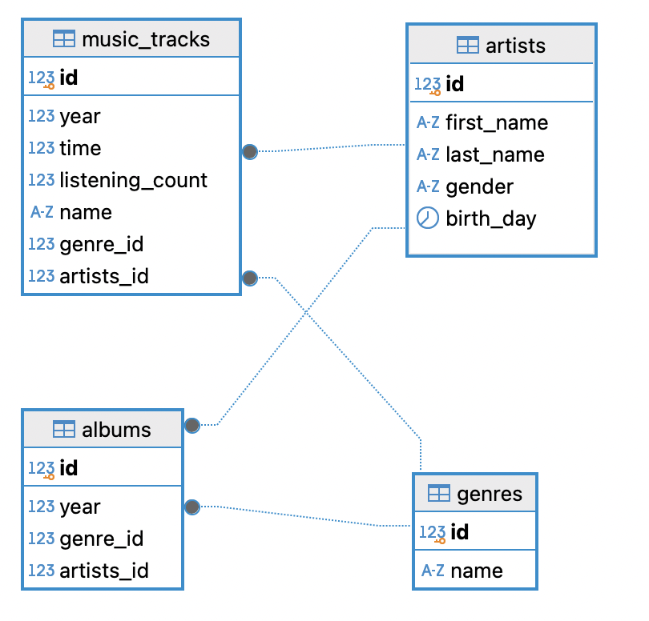

# HomeWork_01

### Задача:
Спроектируйте БД для сервиса прослушивания музыки, в котором будет храниться информация о музыкальных треках(исполнитель, год, время, количество прослушиваний, жанр), об исполнителях, альбомах(исполнитель, год выпуска, жанр). Спроектированныя БД должна быть в 3НФ.

### Решение:
[Скрипты создания таблиц БД](hw_01.sql)

ER Диаграмма
