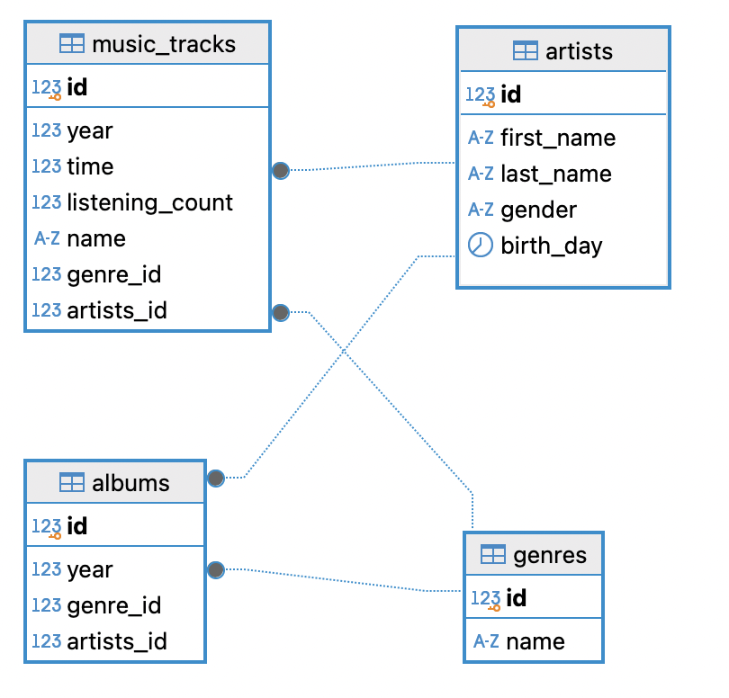

# HomeWork_02

### Задача:
Напишите запросы для создания таблицы, спроектированной в добашнем задании номер 1 Базы данных для сервиса прослушивания музыки, в которой будет храниться информавция о музыкальных треках (испольнитель, год, время, количество прослушиваний, жанр), об иссполнителях, альбомах (исполнитель, год выпускав, жанр). Добавьте связя между таблицами. Выполните запросы на учебной схеме БД. Добавьте в отчет результаты выполнения запросов (например, скрин схемы БД).

### Решение:

Скрин схемы БД
