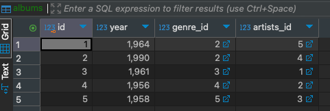
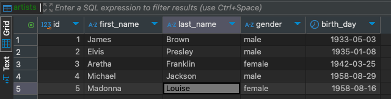
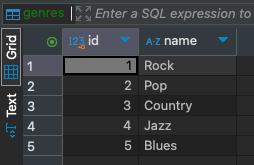
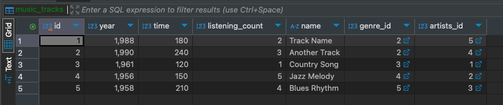

# HomeWork_02

### Задача:
Напишите запросы для наполнения БД (3 трека, 2-3 исполнителя, 1 альбом). Выполните запросы на учебной схеме БД. Добавьте в отчет результат выполнения запросов - скрины заполненных таблиц.

### Решение:

Albums 

   
Artists 

   
Genres 

   
MusicTracks 
