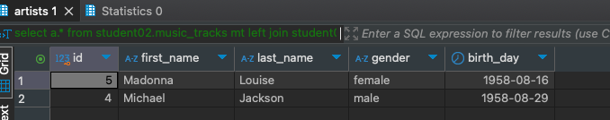

# HomeWork_02

### Задача:
Составьте запросы для поиска исполнителей, у которых есть треки в жанре N (например, поп).
Добавьте в отчер результат выполнения запроса.


### Решение:
```sql
select a.* from student02.music_tracks mt 
left join student02.artists a on a.id = mt.artists_id 
where mt.genre_id in (select g.id from student02.genres g where g.name = 'Pop')
```

Результат<br/>
