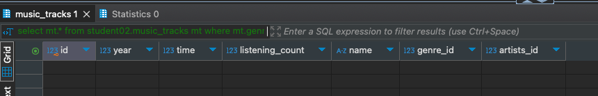

# HomeWork_02

### Задача:
Составьте запросы для поиска треков в жанре Х (например Pop) с числом прослушиваний более 30000
Добавьте в отчер результат выполнения запроса.


### Решение:
```sql
select mt.* from student02.music_tracks mt 
where mt.genre_id in (select g.id from student02.genres g where g.name = 'Pop')
and mt.listening_count > 30000;
```

Результат<br/>
