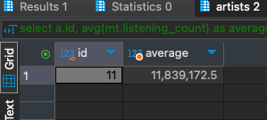

# HomeWork_02

### Задача:
Составьте запросы для поиска исполнителей жанра Y (например Рэп), у которых среднее число прослушиваний треков более 20_000_000
Добавьте в отчер результат выполнения запроса.


### Решение:
```sql
select a.id, avg(mt.listening_count) as average from student02.music_tracks mt 
left join student02.artists a on a.id = mt.artists_id 
where mt.genre_id in (select g.id from student02.genres g where g.name = 'Rap')
group by a.id

```

Результат<br/>
