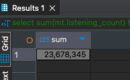

# HomeWork_02

### Задача:
Составьте запросы для определения суммы прослушиваний песен в жанре М.
Добавьте в отчет результат выполнения запроса.


### Решение:
```sql
select sum(mt.listening_count) from student02.music_tracks mt 
where mt.genre_id in (select g.id from student02.genres g where g.name = 'Rap')
```

Результат<br/>
