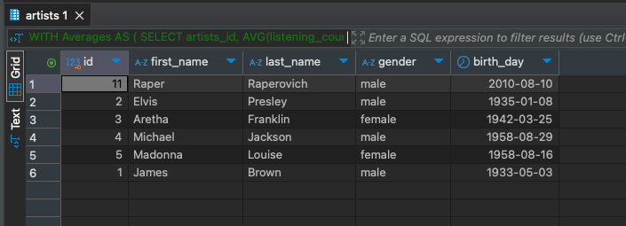

# HomeWork_02

### Задача:
Составьте запросы для определения среднего числа прослушиваний у исполнителей, отсортированных по убыванию количества прослушиваний.
Добавьте в отчет результат выполнения запроса.


### Решение:
```sql
WITH Averages AS (
    SELECT artists_id, AVG(listening_count) AS average_listenings
    FROM music_tracks
    GROUP BY artists_id
)
SELECT artists.*
FROM artists
JOIN Averages ON artists.id = Averages.artists_id
ORDER BY average_listenings DESC;
```

Результат<br/>
