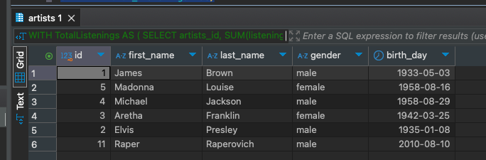

# HomeWork_02

### Задача:
Составьте запросы для определения суммы числа прослушиваний по исполнителям, отсортированным по возрастанию числа прослушиваний.
Добавьте в отчет результат выполнения запроса.


### Решение:
```sql
WITH TotalListenings AS (
    SELECT artists_id, SUM(listening_count) AS total_listenings
    FROM music_tracks
    GROUP BY artists_id
)
SELECT artists.*
FROM artists
JOIN TotalListenings ON artists.id = TotalListenings.artists_id
ORDER BY total_listenings ASC;
```

Результат<br/>
