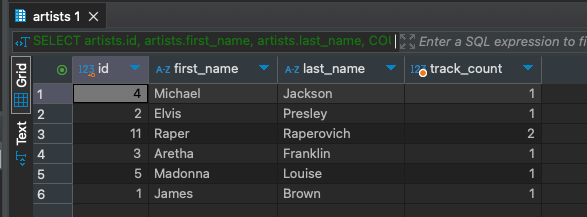

# HomeWork_02

### Задача:
Составьте запрос для определения количества песен у каждого исполнителя
Добавьте в отчет результат выполнения запроса.


### Решение:
```sql
SELECT artists.id, artists.first_name, artists.last_name, COUNT(*) AS track_count
FROM artists
JOIN music_tracks ON artists.id = music_tracks.artists_id
GROUP BY artists.id, artists.first_name, artists.last_name;
```

Результат<br/>
