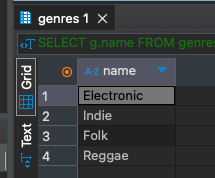

# HomeWork_02

### Задача:
Добавьте в список песню какого-либо исполнителя, заполнив ее жанр значением NULL.
Напишите запрос по выводу списка жанров, для которых нет песен в таблице (с учетом особенностей сравнения с NULL)
Добавьте в отчет результат выполнения запроса.


### Решение:
```sql
SELECT g.name
FROM genres g
LEFT JOIN music_tracks t ON g.id = t.genre_id
WHERE t.genre_id IS NULL;
```

Результат<br/>
