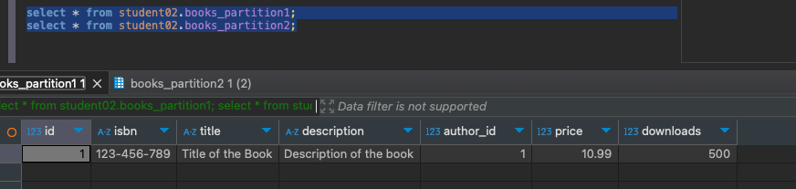
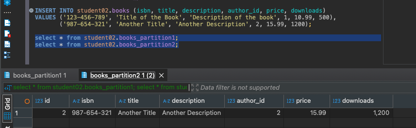

# HomeWork_03

### Задача:
Для таблицы со список книг добавьте разделы партиционирования методом Range по количеству скачиваний:

P1: число скачиваний меньше 1000;
P2: число скачиваний больше или равно 1000 и меньше 10000;
P3: число скачиваний больше или равно 10000.
Добавьте в отчет результаты выполнения запросов (например, скрин схемы БД).


### Решение:
```sql
CREATE TABLE student02.books_partition1 PARTITION OF student02.books FOR VALUES FROM (0) TO (1000);
CREATE TABLE student02.books_partition2 PARTITION OF student02.books FOR VALUES FROM (1000) TO (10000);
CREATE TABLE student02.books_partition3 PARTITION OF student02.books FOR VALUES FROM (10000) TO (MAXVALUE);
```
Результат партиция 1<br/>


Результат партиция 2<br/>
