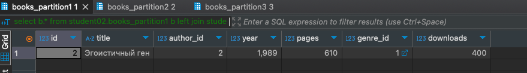
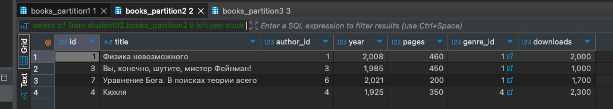
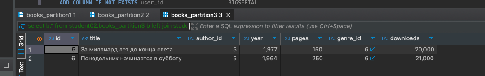

# HomeWork_03

### Задача:
Напишите запросы для наполнения БД. Выполните запросы на учебной схеме БД.

Добавьте в отчет результат выполнения запросов – скрины заполненных таблиц, результаты вызова к партициям.

Название	Автор	Год	Страниц	Жанр	Скачиваний
Физика невозможного	Митио Каку	2008	460	Non-fiction	2000
Эгоистичный ген	Ричард Докинз	1989	610	Non-fiction	400
Вы, конечно, шутите, мистер Фейнман!	Ричард Фейнман	1985	450	Non-fiction	1000
Кюхля	Юрий Тынянов	1925	350	Исторический роман	2300
За миллиард лет до конца света	Аркадий и Борис Стругацкие	1977	150	Фантастика	20000
Понедельник начинается в субботу	Аркадий и Борис Стругацкие	1964	250	Фантастика	21000
Уравнение Бога. В поисках теории всего	Митио Каку	2021	200	Non-fiction	1700
Напишите запрос для получения списка rowid записей в таблицах с книгами, авторами и жанрами.

Проведите анализ значений rowid, приложите информацию в отчет.

Напишите запросы, чтобы проверить, какие книги находятся в партициях p1, p2, p3. Приложите запросы и результаты их выполнения в отчет.


### Решение:
```sql
 select b.id, b.author_id, b.genre_id from student02.books b

 select b.* from student02.books_partition1 b
 left join student02.author a on a.id = b.author_id 
 left join student02.genre g on g.id = b.genre_id 

  select b.* from student02.books_partition2 b
 left join student02.author a on a.id = b.author_id 
 left join student02.genre g on g.id = b.genre_id 

 select b.* from student02.books_partition3 b
 left join student02.author a on a.id = b.author_id 
 left join student02.genre g on g.id = b.genre_id 
```
Результат партиция 1<br/>


Результат партиция 2<br/>


Результат партиция 3<br/>
