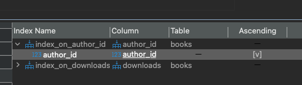

# HomeWork_03

### Задача:
Составьте индекс по автору книги.

Добавьте результаты выполнения в отчет.


### Решение:
```sql
CREATE INDEX index_on_author_id ON student02.books USING btree (author_id);
```
Результат<br/>
