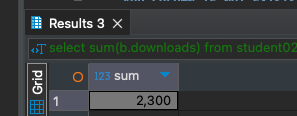

# HomeWork_03

### Задача:
Составьте запрос для определения суммы скачиваний книг в жанре «исторический роман».

Добавьте результаты выполнения в отчет.


### Решение:
```sql
select sum(b.downloads) from student02.books b where b.genre_id = (select g.id from student02.genre g where g.genre = 'Исторический роман')
```
Результат<br/>
