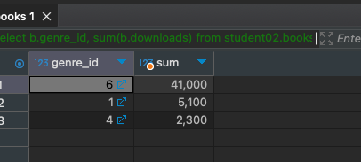

# HomeWork_03

### Задача:
Составьте запрос для определения суммы скачиваний по жанрам.

Добавьте результаты выполнения в отчет.


### Решение:
```sql
select b.genre_id, sum(b.downloads) from student02.books b 
group by b.genre_id;;
```
Результат<br/>
