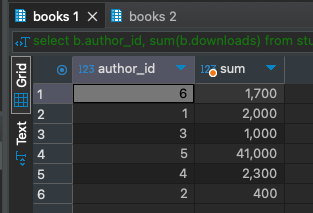

# HomeWork_03

### Задача:
Составьте запрос для определения суммы числа скачиваний по авторам.

Добавьте результаты выполнения в отчет.


### Решение:
```sql
select b.author_id, sum(b.downloads) from student02.books b 
group by b.author_id 
```
Результат<br/>
