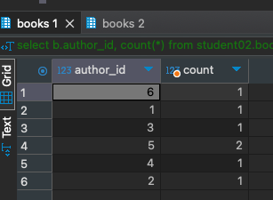

# HomeWork_03

### Задача:
Составьте запрос для определения количества книг у каждого автора.

Добавьте результаты выполнения в отчет.


### Решение:
```sql
select b.author_id, count(*) from student02.books b 
group by b.author_id;
```
Результат<br/>
