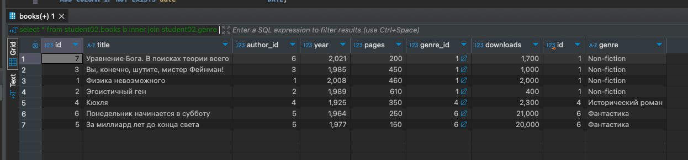
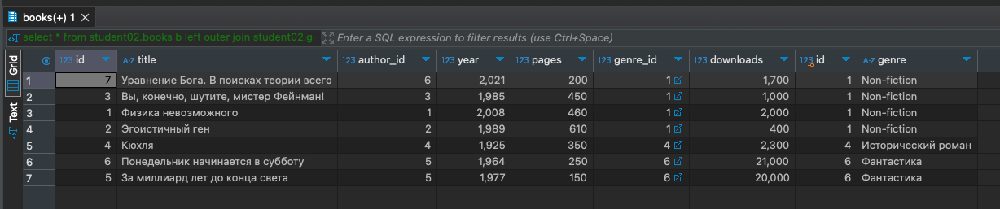
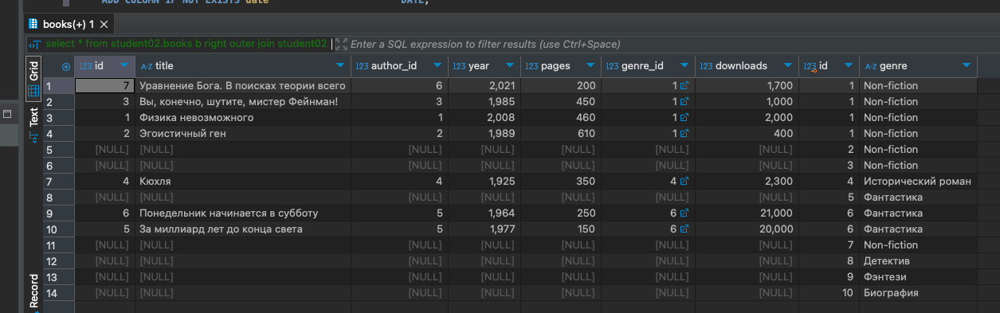
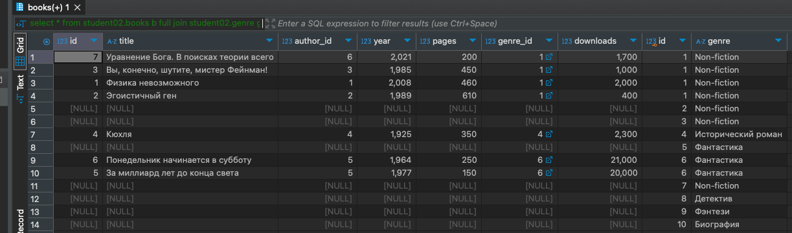

# HomeWork_03

### Задача:
Добавьте в список жанров несколько новых жанров: детектив, фэнтези, биография.

Напишите JOIN запросы для таблиц жанры и книги: INNER JOIN, LEFT OUTER JOIN, RIGHT OUTER JOIN, FULL JOIN.

Добавьте результаты выполнения в отчет.


### Решение:
```sql
INSERT INTO student02.genre (genre)
VALUES ('Детектив'),
       ('Фэнтези'),
       ('Биография');

 select * from student02.books b 
 inner join student02.genre g on g.id = b.genre_id;

 select * from student02.books b 
 left outer join student02.genre g on g.id = b.genre_id;

 select * from student02.books b 
 right outer join student02.genre g on g.id = b.genre_id;

select * from student02.books b 
full join student02.genre g on g.id = b.genre_id;
```
Результат inner join<br/>


Результат left outer join<br/>


Результат right outer joi<br/>


Результат full join<br/>
